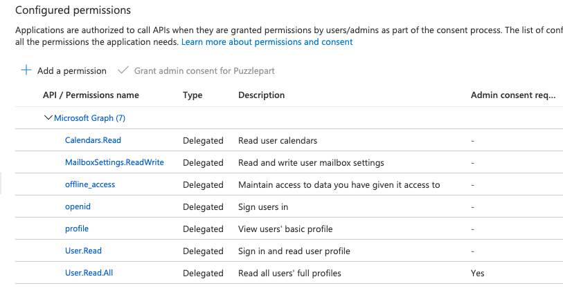

# Contributing to Did

_Contributios are very velcome! Here's some guidance to get started!_ :heart:

## Structure

Folder/File | Description
--- | --- 
`/client` | Client TypeScript source using e.g. [React](https://reactjs.org/) and [Apollo Client](https://www.apollographql.com/docs/react/)`.
`/client/common` | Common elements like icons etc 
`/client/components` | React components reusable throughout the solution 
`/client/config` | Conifguration 
`client/graphql` | Graphql implementation for the client using `@apollo/client` 
`client/helpers` | Helper functions 
`client/pages` | Main pages of the solution 
`client/types` | Types, models and interfaces 
`client/utils` | Utility functions 
`client/index.tsx` | Main entry point for the app 
`/server/public` | Public assets, static files hosted under "/"
`/server/public/css` | CSS files
`/server/public/js` | JS files (hidden from `vscode`, the react bundle ends up here)
`/server/routes` | [Express](https://expressjs.com/) routes using [HBS](https://handlebarsjs.com/) views
`/server/api` | Server side APIs
`/server/api/graphql` | [GraphQL](https://github.com/graphql/graphql-js/) implementation
`/server/api/graphql/resolvers` | GraphQL resolvers, queries and mutations
`/server/middleware` | Server side Express middleware functions
`/server/middleware/passport` | [Passport](http://www.passportjs.org/) authentication middleware
`/server/services` | Services ([MS Graph](https://developer.microsoft.com/en-us/graph) and [Azure Table Storage](https://azure.microsoft.com/en-us/services/storage/tables/))
`/server/utils` | Utilities
`/server/views` | Express HBS views
`server/app.ts` | Express app
`server/index.ts` | [Node.js](http://nodejs.org/) server  

## Development

**NB: Did should be developed with node >=12.18.3**

1. Check out the dev branch
2. Run `npm install`
3. Run `npm run-script create-env` to create your own `.env` file for local testing
4. Set neccessary parameters in your new `.env` file (see `Set up .env` below)
5. Install the [Azure App Service extension for vscode](https://marketplace.visualstudio.com/items?itemName=ms-azuretools.vscode-azureappservice)
6. Create an Azure app registration, or ask one of the [maintainers](#maintainers) for access to an existing one
7. Run `npm run-script watch` to watch both `server` and `client` changes concurrently  

The following permissions are required by Azure App Registration:

### Resource management with i18n

* Install vscode extension `antfu.i18n-ally`

### Mocha tests

`npm run tests` will run our mocha tests for the event matching. It will automatically fetch customers, projects and labels from Azure Table Storage if environment `TESTS_AZURE_STORAGE_CONNECTION_STRING` is set.

`TESTS_AZURE_STORAGE_CONNECTION_STRING` should be set to the connection string for [didtestdata](https://portal.azure.com/#@puzzlepart.com/resource/subscriptions/b5e5e285-a57a-4593-a2ef-221dc037ac9f/resourcegroups/pzl-did/providers/Microsoft.Storage/storageAccounts/didtestdata/overview).

## GraphQL Documentation

_We use https://studio.apollographql.com/ for GraphQL documentation._

## Set up .env ##

You've copied `.env.sample` into `.env`. Manually or using `npm run-script create-env`.

Now you need to set the following properties/parameters:

**OAUTH_APP_ID**
ID of the AD application registration.

**OAUTH_APP_PASSWORD**
Password/key of the AD application registration.

**AZURE_STORAGE_CONNECTION_STRING**
Connection string for the Azure Table Storage

**SESSION_SIGNING_KEY**
Just a random string to secure the sessions.

## Branching / Deploying

The `/main` branch requires pull requests, and is set up with a CI/CD pipeline which deploys to [did365.puzzlepart.com](https://did365.puzzlepart.com)  
The `/dev` branch also requires pull requests, and is set up with a CI/CD pipeline which deploys to [didapp.azurewebsites.net](https://didapp.azurewebsites.net)  
`/feature/*`-prefixed branches may or may not be included in future releases.

You are encouraged to branch with either of the following prefixes  
*  **hotfix/**
*  **bugfix/**
*  **feature/**

See also ["A successful Git branching model"](https://nvie.com/posts/a-successful-git-branching-model/)

If you want to test with your web app, checkout [Creating your own app registration in the Azure Portal](https://github.com/Puzzlepart/did365/wiki/Creating-your-own-app-registration-in-the-Azure-Portal) in our wiki.
