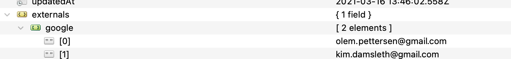
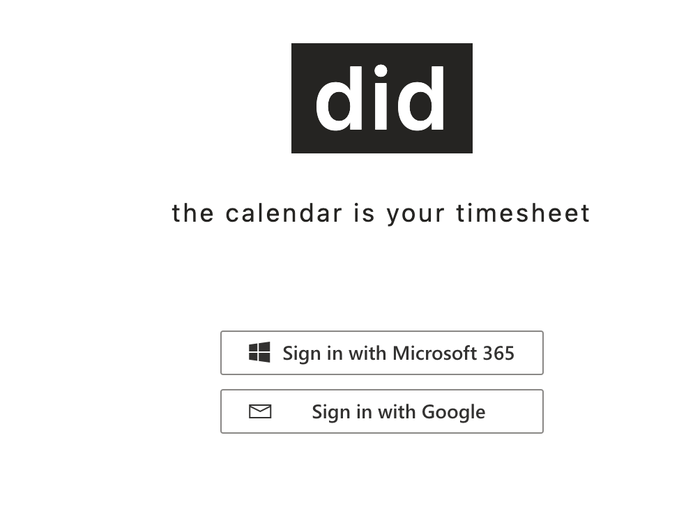

<!-- ⚠️ This README has been generated from the file(s) ".readme/README.md" ⚠️-->

  

 

  <b>the calendar is your timesheet</b> 
  Keep your calendar up-to-date with what you work on, and that's it. You're done.

 

📖 Table of Contents

 

## ➤ Table of Contents

* [➤ Roadmap](#-roadmap)
* [➤ Backlog](#-backlog)
* [➤ Environments](#-environments)
* [➤ Contributing](#-contributing)
	* [Getting started](#getting-started)
		* [Set up environment](#set-up-environment)
	* [Code structure](#code-structure)
	* [Node version](#node-version)
	* [Authentication](#authentication)
		* [Google](#google)
	* [Branching / Deploying](#branching--deploying)
		* [Main branch](#main-branch)
		* [Dev branch](#dev-branch)
	* [Feature branches](#feature-branches)
		* [Naming conventions](#naming-conventions)
		* [See also](#see-also)
	* [GraphQL](#graphql)
		* [Extensions for VS Code](#extensions-for-vs-code)
	* [Documentation](#documentation)
* [➤ Contributors](#-contributors)

## ➤ Roadmap

| Milestone                                                    | Release date | Version                                                      |
| ------------------------------------------------------------ | ------------ | ------------------------------------------------------------ |
| [💧 &nbsp;1 - &nbsp;Hydrogen](https://github.com/Puzzlepart/did365/milestone/1) | 03.02.2020   |  |
| [🎈 &nbsp;2 - &nbsp;Helium](https://github.com/Puzzlepart/did365/milestone/2) | 02.04.2020   |  |
| [🔋 &nbsp;3 - &nbsp;Lithium](https://github.com/Puzzlepart/did365/milestone/5) | 11.05.2020   |  |
| [🛰 &nbsp;4 - &nbsp;Beryllium](https://github.com/Puzzlepart/did365/milestone/3) | 22.05.2020   |  |
| [☄️ &nbsp;5 - &nbsp;Boron](https://github.com/Puzzlepart/did365/milestone/4) | 19.08.2020   |  |
| [🌱 &nbsp;6 - &nbsp;Carbon](https://github.com/Puzzlepart/did365/milestone/6) | 09.09.2020   |  |
| [💨 &nbsp;7 - &nbsp;Nitrogen](https://github.com/Puzzlepart/did365/milestone/7) | 15.10.2020   |  |
| [🅾️ &nbsp;8 - &nbsp;Oxygen](https://github.com/Puzzlepart/did365/milestone/8) | 15.12.2020   |  |
| [🦷 &nbsp;9 - &nbsp;Fluor](https://github.com/Puzzlepart/did365/milestone/9) | 27.04.2021   |  |
| [💡 &nbsp;10 - &nbsp;Neon](https://github.com/Puzzlepart/did365/milestone/10) | 16.11.2022      |  |
| [🧂 &nbsp;11 - &nbsp;Sodium](https://github.com/Puzzlepart/did365/milestone/11) | 17.04.2023      |  |
| [🧲 &nbsp;12 - &nbsp;Magnesium](https://github.com/Puzzlepart/did365/milestone/12) | 21.02.2024      |  |
| [⚪ &nbsp;13 - &nbsp;Aluminium](https://github.com/Puzzlepart/did365/milestone/13) | 25.02.2025      |  |
| [🛎️ &nbsp;14 -  &nbsp;Silisium](https://github.com/Puzzlepart/did365/milestone/13) | 12.03.2025 |  |
| [🦿 &nbsp;15 -  &nbsp;Fosfor](https://github.com/Puzzlepart/did365/milestone/15) | 28.04.2025 |  |

## ➤ Backlog

Our backlog can be found [here](https://github.com/orgs/Puzzlepart/projects/7).

## ➤ Environments

| Environment | Branch/Tag   | CI | Status |
| ----------- | ------------------------------------------------------------  | ------------------------------------------------------------ | ------------------------------------------------------------ |
| [Production](https://did.puzzlepart.com)     | **main** | [Yes](https://portal.azure.com/#@puzzlepart.com/resource/subscriptions/b5e5e285-a57a-4593-a2ef-221dc037ac9f/resourceGroups/pzl-did/providers/Microsoft.Web/sites/didapp/vstscd) |  |
| [Development (new features)](https://didapp-dev.azurewebsites.net) | **dev** and  **feat/**  | [Yes](https://portal.azure.com/#@puzzlepart.com/resource/subscriptions/b5e5e285-a57a-4593-a2ef-221dc037ac9f/resourceGroups/pzl-did/providers/Microsoft.Web/sites/didapp/slots/dev/vstscd) |  |
| [Staging (pre-prod)](https://didapp-staging.azurewebsites.net) | Release tags | [Yes](https://portal.azure.com/#@puzzlepart.com/resource/subscriptions/b5e5e285-a57a-4593-a2ef-221dc037ac9f/resourceGroups/pzl-did/providers/Microsoft.Web/sites/didapp/slots/staging/vstscd) |  |

## ➤ Contributing

_Contributions are very velcome! Here's some guidance to get started!_ :heart:

### Getting started

1. Check out the `dev` branch
2. Run `npm install`
3. Run `npm run-script create-env` to create your own `.env` file for local testing
4. Set neccessary parameters in your new `.env` file (see `Set up .env` below)
5. Install the [Azure App Service extension for vscode](https://marketplace.visualstudio.com/items?itemName=ms-azuretools.vscode-azureappservice)
6. Install the [ESLint extension for vscode](https://marketplace.visualstudio.com/items?itemName=dbaeumer.vscode-eslint)
7. Install the [i18n Ally extension for vscode](https://marketplace.visualstudio.com/items?itemName=Lokalise.i18n-ally)
8. Create an Azure app registration, or ask one of the [maintainers](#maintainers) for access to an existing one
9. Run `npm run-script watch` to watch both `server` and `client` changes concurrently  

The following permissions are required by Azure App Registration:

#### Set up environment

You've copied `.env.sample` into `.env`, anually or using `npm run-script create-env`.

Now you need to set the required environment variables from this table:

| Key                             | Description                                                  | Required |
| ------------------------------- | ------------------------------------------------------------ | -------- |
| `AUTH_PROVIDERS`          | Auth providers. E.g. `azuread-openidconnect` and `google`.   | **Yes**  |
| `MICROSOFT_CLIENT_ID` | ID of the AD application registration. | **Yes** |
| `MICROSOFT_CLIENT_SECRET` | Password/secret of the AD application registration. | **Yes** |
| `MICROSOFT_REDIRECT_URI` | Redirect URL for Microsoft (`azuread-openidconnect`) login   | **Yes**  |
| `MICROSOFT_SCOPES` | Scopes for Microsoft Graph queries. See https://docs.microsoft.com/en-us/azure/active-directory/develop/v2-permissions-and-consent. | **Yes**  |
| `GOOGLE_CLIENT_ID` | ID of the Google application registration | No |
| `GOOGLE_CLIENT_SECRET` | Password/secret of the Google registration. | No |
| `GOOGLE_REDIRECT_URI` | Redirect URL for Google login | No |
| `GOOGLE_SCOPES` | Scopes for Google APIs and login | No |
| `PORT` | Defaults to `9001` | No       |
| `SESSION_NAME` | A unique name for the sessions. | No |
| `SESSION_SIGNING_KEY` | Just a random string to secure the sessions. | **Yes** |
| `REDIS_CACHE_HOSTNAME` | Hostname for the [Redis cache]([Redis](https://redis.io/)) | **Yes** |
| `REDIS_CACHE_KEY` | Secret key for the [Redis cache]([Redis](https://redis.io/)) | **Yes** |
| `APOLLO_KEY` | Key for reporting to [Apollo Studio](https://studio.apollographql.com/org/puzzlepart/graphs) | **Yes**  |
| `APOLLO_GRAPH_VARIANT` | Graph variant for reporting to [Apollo Studio](https://studio.apollographql.com/org/puzzlepart/graphs). See [this article](https://www.apollographql.com/docs/apollo-server/monitoring/metrics/) | **Yes**  |
| `MONGO_DB_CONNECTION_STRING` | Connection string for MongoDB                                | **Yes**  |
| `MONGO_DB_DB_NAME` | Database name for MongoDB                                    | **Yes**  |
| `API_TOKEN_SECRET` | Secret to generate API tokens                                | **Yes**  |
| `DEBUG`                         | To debug the Node backend. E.g. `app*` to see all logs from app. See [debug](https://www.npmjs.com/package/debug). | No       |
| `LAUNCH_BROWSER`      | Set to `1` if you want to automatically open did in the browser when running `watch` task. | No       |

### Code structure

| Folder/File                   | Description                                                  |
| ----------------------------- | ------------------------------------------------------------ |
| `/shared`                     | Shared code between client and server                        |
| `/shared/config`              | Configuration files used across client and server            |
| `/shared/config/security`     | Shared security configuration and permission definitions     |
| `/shared/utils`               | Utility functions shared between client and server           |
| `/client`                     | Client TypeScript source using React and Apollo Client       |
| `/client/app`                 | Core application files including entry point and router      |
| `/client/components`          | Reusable React components used throughout the solution       |
| `/client/graphql-client`      | Apollo client setup and configuration                        |
| `/client/graphql-mutations`   | GraphQL mutation definitions                                 |
| `/client/graphql-queries`     | GraphQL query definitions                                    |
| `/client/hooks`               | Custom React hooks                                           |
| `/client/i18n`                | Internationalization files and translation resources         |
| `/client/logging`             | Client-side logging functionality                            |
| `/client/pages`               | Main application pages organized by feature                  |
| `/client/parts`               | Page sections and partial components                         |
| `/client/theme`               | Styling, theme configuration, and icon catalog               |
| `/client/types`               | TypeScript type definitions and interfaces                   |
| `/client/utils`               | Client-side utility functions                                |
| `/server/public`              | Public assets and static files served under "/"              |
| `/server/routes`              | Express routes using Handlebars views                        |
| `/server/graphql`             | GraphQL schema and resolvers                                |
| `/server/middleware`          | Express middleware functions                                 |
| `/server/services`            | Business logic services (MS Graph, database, etc.)           |
| `/server/utils`               | Server-side utility functions                                |
| `/server/views`               | Express Handlebars view templates                            |
| `/server/app.ts`              | Express app configuration                                    |
| `/server/index.ts`            | Node.js server entry point                                   |
| `/assets`                     | Static assets like images and error pages                    |
| `/webpack`                    | Webpack configuration and build utilities                    |

### Node version

**NB: did should be developed with node 18.18.0**

_It's recommended to use `nvm`. We have a `.nvrc` with node version set to 18.18.0._

### Authentication

did supports authentication with both Microsoft (`azuread-openidconnect`) and Google, but `google` support is in _experimental state_ only supporting adding gmail accounts as externals to an existing Microsoft did subscription.

The auth providers are set in `process.env.AUTH_PROVIDERS` and sent to the client through GraphQL query `authProviders`.

#### Google
See [wiki](https://github.com/Puzzlepart/did/wiki/Usage-with-Google-calendar) for more details on using did with Google.

### Branching / Deploying

#### Main branch

The `/main` branch requires pull requests, and is set up with a CI/CD pipeline which deploys to [did.puzzlepart.com](https://did.puzzlepart.com)  

#### Dev branch
The `/dev` branch also requires pull requests, and is set up with a CI/CD pipeline which deploys to [didapp-dev.azurewebsites.net](https://didapp-dev.azurewebsites.net).

### Feature branches
For new features use the naming convention below. A CI/CD pipeline which deploys to [didapp-dev.azurewebsites.net](https://didapp-dev.azurewebsites.net) is set up for branches matching the pattern `feat/*` and `dev`.

#### Naming conventions
You are encouraged to branch with either of the following prefixes  
*  **hotfix/**
*  **bugfix/**
*  **feat/**

#### See also
See also [A successful Git branching model](https://nvie.com/posts/a-successful-git-branching-model/)

If you want to test with your web app, checkout [Creating your own app registration in the Azure Portal](https://github.com/Puzzlepart/did365/wiki/Creating-your-own-app-registration-in-the-Azure-Portal) in our wiki.

### GraphQL

#### Extensions for VS Code
The extension [Apollo extension for VS Code](https://www.apollographql.com/docs/devtools/editor-plugins/) is recommended for working with GraphQL in vscode.

> The Apollo [VS Code extension](https://marketplace.visualstudio.com/items?itemName=apollographql.vscode-apollo) provides an all-in-one tooling experience for developing apps with Apollo.
>
> The extension enables you to:
>
> - Add [syntax highlighting](https://www.apollographql.com/docs/devtools/editor-plugins/#syntax-highlighting) for GraphQL files and gql templates inside JavaScript files
> - Get instant feedback and [intelligent autocomplete](https://www.apollographql.com/docs/devtools/editor-plugins/#intelligent-autocomplete) for fields, arguments, types, and variables as you write queries
> - Manage client side schema alongside remote schema
> - See [performance information](https://www.apollographql.com/docs/devtools/editor-plugins/#performance-insights) inline with your query definitions
> - Validate field and argument usage in operations
> - [Navigate projects more easily](https://www.apollographql.com/docs/devtools/editor-plugins/#navigating-projects) with jump-to and peek-at definitions
> - Manage [client-only](https://www.apollographql.com/docs/devtools/editor-plugins/#client-only-schemas) schemas
> - [Switch graph variants](https://www.apollographql.com/docs/devtools/editor-plugins/#graph-variant-switching) to work with schemas running on different environments

### Documentation

_We use https://studio.apollographql.com/ for GraphQL schema documentation._

## ➤ Contributors
	

|  |  |  |
|:--------------------------------------------------:|:--------------------------------------------------:|:--------------------------------------------------:|
| [Carl Joakim Damsleth](undefined)                | [Ole Martin Pettersen](undefined)                | [Ole Kristian Mørch-Storstein](undefined)        |
| [carl.joakim.damsleth@puzzlepart.com](mailto:carl.joakim.damsleth@puzzlepart.com) | [olemp@puzzlepart.com](mailto:olemp@puzzlepart.com) | [olekms@puzzlepart.com](mailto:olekms@puzzlepart.com) |
